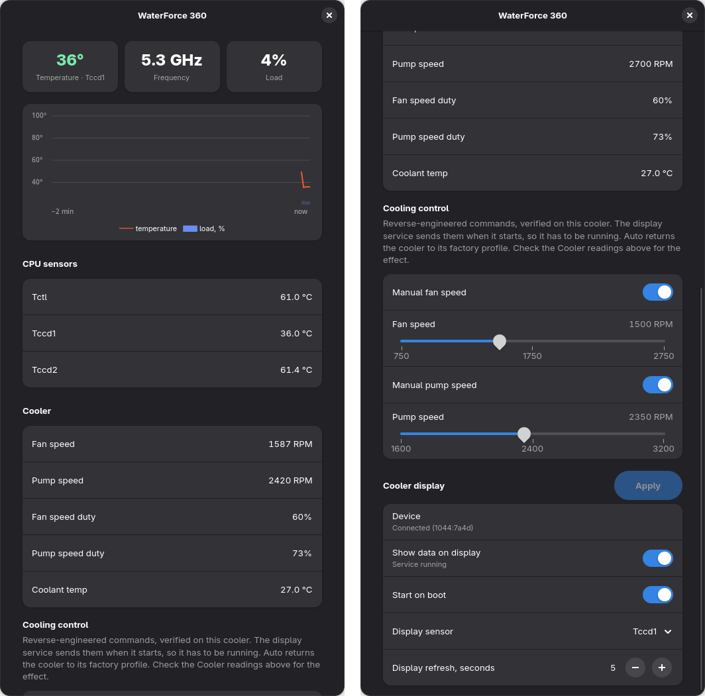

# Aorus WaterForce 360 cooler HID updater for Linux
## (°C, GHz, %CPU)

***
### By: fourgl@gmail.com 2026
***

A small daemon that feeds CPU temperature, frequency and load to the LCD of the
Gigabyte AORUS WATERFORCE 360 AIO, plus an optional GTK control panel that shows CPU
and cooler readings and sets fan and pump speed.



## Dependencies:
  * Build: Go 1.20+ (no cgo, no third-party modules — the daemon writes to `/dev/hidraw` directly)
  * Control panel: Python 3, PyGObject, GTK 4, libadwaita, polkit
    (Arch: `python-gobject gtk4 libadwaita`)
  * Linux 6.8+ recommended: the in-tree `gigabyte_waterforce` hwmon driver provides the
    fan/pump RPM and coolant temperature readings

## Build:
  * Configure your vars of the `main.go` if needed
  * `go build -o AorusWaterForce360-linux main.go`

## Installation:
  ```sh
  sudo ui/install.sh
  ```
  It installs and (on first run) enables the systemd service, the control panel
  (`awf360-ui`, "WaterForce 360" in the app menu), its root helper `/usr/local/bin/awf360-ctl`
  and a polkit policy. Re-run it after rebuilding to upgrade.

  Check status: `systemctl status AorusWaterForce360-linux`

  Service only, without the control panel: copy the binary to `/usr/local/bin/` and
  `AorusWaterForce360-linux.service` to `/etc/systemd/system/`, then
  `sudo systemctl daemon-reload && sudo systemctl enable --now AorusWaterForce360-linux`.

## Control panel:
  * **CPU**: temperature of the sensor sent to the display, frequency, load, a 2-minute graph,
    all `k10temp`/`coretemp` sensors
  * **Cooler**: fan and pump RPM, duty and coolant temperature from the kernel driver
  * **Cooling control**: manual fan speed (750–2750 RPM) and pump speed (1600–3200 RPM);
    switching manual off returns the cooler to its factory profile
  * **Cooler display**: start/stop the service, start on boot, which CPU sensor to show
    (`Tccd1`, `Tctl`, …) and the refresh interval

  Settings are stored as a systemd drop-in
  (`/etc/systemd/system/AorusWaterForce360-linux.service.d/ui.conf`):
  `AWF_SENSOR`, `AWF_INTERVAL`, `AWF_FAN_RPM`, `AWF_PUMP_RPM` (0 = factory profile).
  The panel changes them through `pkexec awf360-ctl`, which validates every value.
  The polkit policy lets the active local session do this without a password; change
  `allow_active` to `auth_admin_keep` in `ui/com.github.fourgl.awf360.policy` to require one.

## Protocol notes:
  All commands are HID output reports with report ID `0x99`, zero-padded to 6144 bytes.

  | Command | Meaning |
  |---|---|
  | `99 E0 …` | LCD data: CPU temperature, frequency, load |
  | `99 E5 01 <p>` | fan profile: `01` = custom curve, `05` = factory default |
  | `99 E5 02 <p>` | pump profile: `01` = custom curve, `00` = factory default |
  | `99 E6 01 01` + 4 × `[temp °C][RPM be16]` | fan curve |
  | `99 E6 04 02` + 4 × `[temp °C][RPM be16]` | pump curve |

  The daemon sends a flat curve (same RPM at every point) once when it starts. The
  cooler stores profiles and curves itself, so they are not re-sent every cycle.
  The fan/pump commands are reverse-engineered and were verified on a WATERFORCE 360
  (`1044:7a4d`) by setting speeds and reading the real RPM back from the kernel driver.
  Curve layout: Aleksa Savic's pre-mainline
  [waterforce-hwmon](https://github.com/amazonparrot/waterforce-hwmon) driver;
  profile selection: [liquidctl#870](https://github.com/liquidctl/liquidctl/pull/870).

  Writing through hidraw keeps the kernel driver bound, so the hwmon readings keep working
  while the display is updated. If the cooler is replugged, the daemon exits and systemd
  restarts it on the new device node.

## Device:
  ID `1044:7a4d` Chu Yuen Enterprise Co., Ltd Castor3

## Tested on:
  * AMD 7700X with Arch Linux (BTW :))
  * AMD 9950X3D with CachyOS (Linux 7.2, GNOME 50)

## Have fun!
